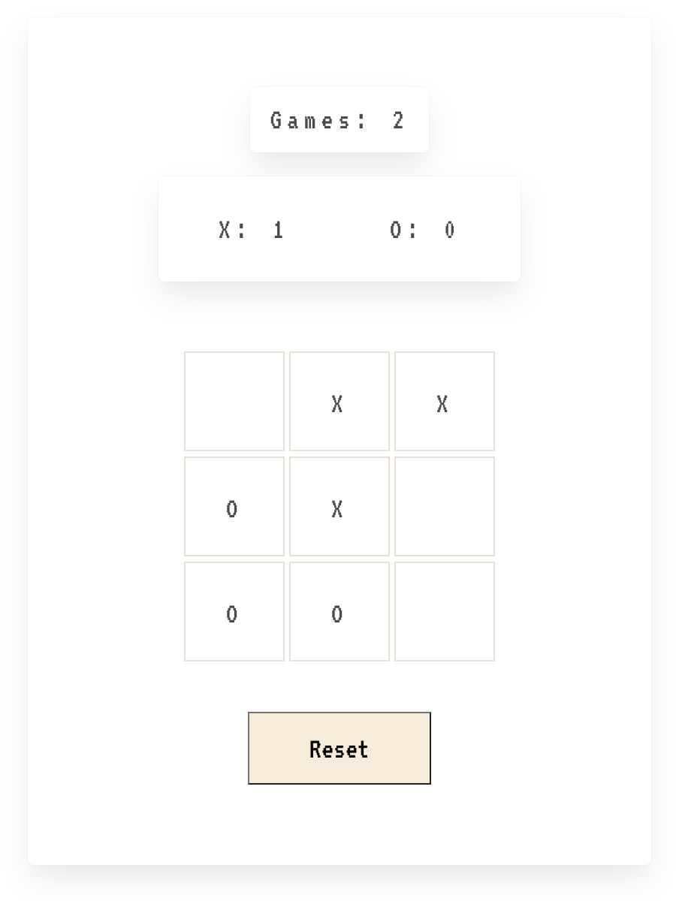

Hi, this is my primitive version of tic-tac-toe

Basically my first project using React.js

Here I learned what is component, state, hooks

In the next iterations I would improve it by adding some visual effects, maybe history of moves or posibility to play with a computer

